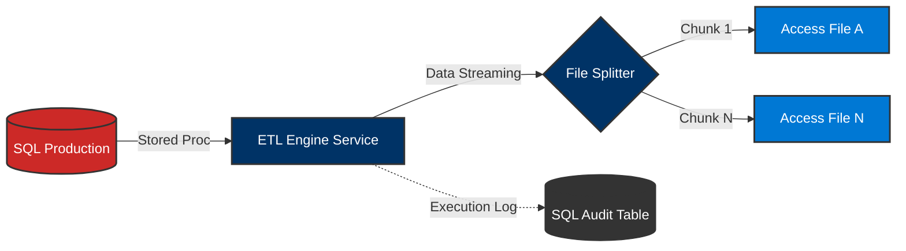

# SEZ_AccesDB_Module
> **High-Performance SQL Server to Microsoft Access ETL Engine**

  
  
  
  

---

## 💎 Overview
**SEZ_AccesDB_Module** is an enterprise-grade ETL solution designed to automate the extraction of complex datasets from SQL Server into portable Microsoft Access (`.accdb`) databases. Engineered for reliability, it features **intelligent file splitting**, **automated synchronization**, and **full audit traceability**.

### 🌟 Core Value Proposition
-   **Scale**: Handle multi-million row datasets without memory exhaustion.
-   **Integrity**: 100% audit coverage for every data transfer.
-   **Efficiency**: One-click execution with automated configuration syncing.

---

## 🛠️ Documentation Portal
Navigate through the comprehensive technical documentation for the SEZ Suite.

| Guide | Description | Target Audience |
| :--- | :--- | :--- |
| 🚀 **[Operations Guide](docs/Operations_Guide.md)** | Daily execution, monitoring, and troubleshooting. | Operators / Admins |
| ⚙️ **[Configuration Reference](docs/Configuration_Reference.md)** | Deep dive into `appsettings.json` and `procedures.json`. | Config Managers |
| 🏗️ **[Architecture Overview](docs/Architecture_Overview.md)** | System design, data flow, and chunking logic. | Developers / Architects |
| 🛠️ **[Maintenance Guide](docs/Maintenance_Guide.md)** | Adding new procedures and automation sync. | DBAs / Developers |

---

## 🧩 How It Works
The system follows a streamlined pipeline from production SQL databases to local Access storage.

---

## ⚡ Features at a Glance

### 🛡️ Intelligent Data Splitting
Never worry about the 2GB limit. The **Data Chunker** automatically monitors row counts and splits data into multiple files, ensuring seamless delivery.

### 🔄 Automated Schema Sync
The `ConfigValidator` toolset keeps your JSON definitions in perfect parity with your SQL Server stored procedures. No more manual entry errors.

### 📊 Real-time Monitoring
Powered by `Spectre.Console`, the interface provides high-fidelity progress bars and deep execution metrics upon completion.

---

## 🚦 Quick Start

> [!TIP]
> Ensure you have the **Microsoft Access Database Engine 2016 Redistributable** installed before running.

1.  **Configure**: Update `appsettings.json` with your connection string.
2.  **Verify**: Run `powershell -File tools/ConfigValidator/Validate-Procedures.ps1` to check integrity.
3.  **Execute**: Run `run-release.bat`.

---

## 📄 License
This project is licensed under the MIT License - see the [LICENSE](LICENSE) file for details.

© 2026 SEZ Trade Division. All Rights Reserved.
