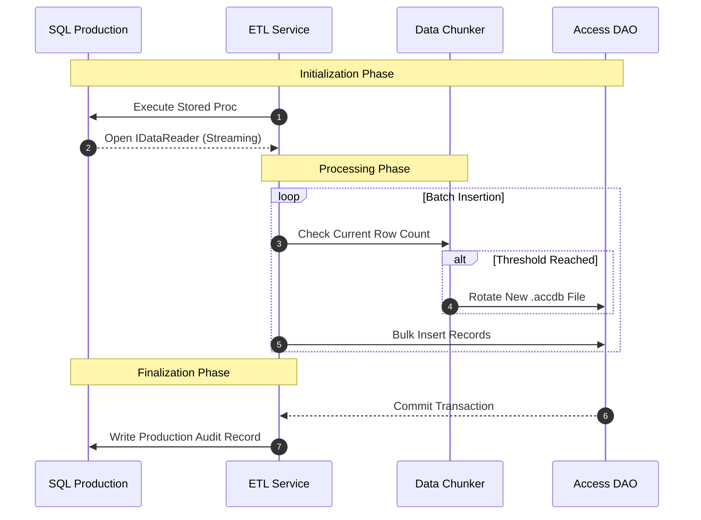

# Architecture Overview
> **Deep-Dive Technical Design**

The **SEZ_AccesDB_Module** architecture is optimized for high-throughput, memory-efficient data transfers. Its decoupled structure ensures reliability across both production SQL instances and local Access file systems.

---

## 🏛️ Layered System Design
Our architecture prioritizes clean separation of concerns, providing a structured approach to data orchestration.

```mermaid
graph TD
    classDef ui fill:#003366,stroke:#333,stroke-width:2px,color:#fff;
    classDef engine fill:#FFCC00,stroke:#333,stroke-width:1.5px,color:#000;
    classDef infra fill:#333333,stroke:#333,stroke-width:1px,color:#fff;
    classDef data fill:#CC2927,stroke:#333,stroke-width:2px,color:#white;

    UI[Console UI Layer<br/>(Spectre.Console)]:::ui --> ORCH[Orchestration Engine]:::engine
    ORCH --> ETL[ETL Logic Service]:::engine
    ORCH --> CFG[Config Manager]:::engine
    ETL --> SQL[SQL Server Provider]:::infra
    ETL --> ACC[MS Access Provider]:::infra
    SQL -.- DB[(SQL Source)]:::data
    ACC -.- FL[Output Directory]:::data
```

---

## 🛤️ The Data Journey
Understanding the flow of a single record from the database to the destination file.



---

## 🔩 Key Technical Pillars

### ⚡ Memory Efficiency
Since datasets can contain millions of rows, the system **never loads the entire result set into RAM**. It leverages `IDataReader` for forward-only streaming, ensuring the application footprint remains minimal regardless of dataset size.

### 🛡️ Smart Rotation (Chunking)
The **Data Chunker** monitors the output Access file size and row count in real-time. When a threshold (default: 2M rows) is approached, it gracefully shuts the current file, provisions a new one from a template, and continues the stream without interruption.

### 🧩 Plugin-ready Providers
The underlying data providers are abstracted, allowing for future extensions (e.g., CSV, Excel, or Cloud Storage) without modifying the core ETL orchestration logic.

---

## 📊 Component Breakdown

-   **`SEZ_AccesDB_Module.Core`**: Defines common contracts (`IProcedureDefinition`), results, and shared DTOs.
-   **`SEZ_AccesDB_Module.Infrastructure`**: Low-level database drivers and file system utilities.
-   **`SEZ_AccesDB_Module.Services`**: Core business domain, ETL logic, and auditing services.
-   **`SEZ_AccesDB_Module.UI`**: Modern console experience and input validation.

---

> [!NOTE]
> All diagrams follow the **SEZ Corporate Style Guide**, representing different layers with specific brand colors for clarity.
