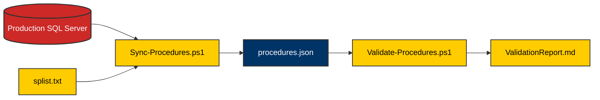

# Maintenance & Development
> **Configuration Synchronization and Build Lifecycle**

This guide covers the automated tools and procedures required to maintain the **SEZ_AccesDB_Module** in a rapidly evolving production environment.

---

## 🏗️ Configuration Automation Flow
Our `ConfigValidator` suite keeps the ETL definitions in sync with the SQL database schema.



---

## 🧩 Adding a New Procedure

> [!IMPORTANT]
> The SP name in `splist.txt` must match the SQL Server name exactly (case-sensitive).

### Step 1: SQL Definition
Ensure the stored procedure is deployed to the production environment and follows the expected parameter format (`mon`, `mon1`).

### Step 2: Update spList
Add the procedure name to `tools/ConfigValidator/splist.txt` on a new line.

---

### Step 3: Run Synchronization

> [!TIP]
> Use `Sync-Procedures.ps1` to automatically generate the metadata for the new SP, including staging table names and parameters.

```powershell
powershell -File tools/ConfigValidator/Sync-Procedures.ps1
```

---

### Step 4: Final Validation
After syncing, verify the integrity of the updated `procedures.json`.

```powershell
powershell -File tools/ConfigValidator/Validate-Procedures.ps1
```

---

## 🛠️ Build and Release Lifecycle

### 🧱 Full System Build
Compilation and artifact generation should only be performed after validation passes.

1.  **Build**: `scripts/build.bat`
2.  **Publish (Release)**: `scripts/publish-x64.bat`

---

## 🚦 Packaging Checklist

- [ ] `procedures.json`: Verified against production SQL.
- [ ] `appsettings.json`: Correct connection string for the target environment.
- [ ] `Logs/`: Directory created and writable.
- [ ] `Output/`: Directory created and writable.

---

> [!IMPORTANT]
> Always retain a backup of the previous `procedures.json` before performing a sync operation.
