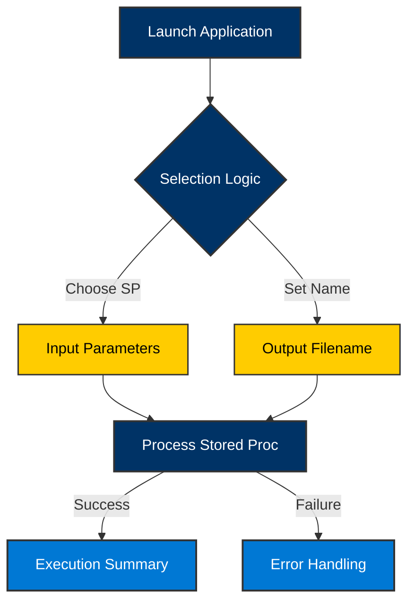

# Operations Guide
> **Daily Execution and Monitoring**

This guide is designed for production operators who manage and monitor the **SEZ_AccesDB_Module** lifecycle.

---

## 🏗️ Application Workflow
Understanding the operational steps from launch to final report.

---

## ⚡ Execution Steps

### 1. Pre-Run Verification

> [!IMPORTANT]
> Always verify that your SQL Server credentials are valid and that the target `OutputPath` exists.

1.  Navigate to the project root.
2.  Optionally, run the **Prerequisite Check**: `scripts/check-prereqs.bat` to verify environment parity.

---

### 2. Launch
Execute the **`run-release.bat`** file to start the session. You will be greeted with the SEZ Interactive Menu.

### 3. Procedure Selection
Use the **Keyboard Navigation**:
-   **Arrows (↑/↓)**: Navigate through the list of stored procedures.
-   **Enter**: Select the highlighted procedure.
-   **Ctrl+C**: Cancel and exit the process anytime.

---

### 4. Parameter Entry

> [!TIP]
> Use the format `YYYYMM` for monthly parameters (e.g., `202301`).

1.  Enter values for each required parameter.
2.  Provide a **Descriptive Output Filename** (e.g., `Export_Jan_2023`).

---

## 🛡️ Monitoring and Safety

### 📈 Progress Tracking
While the ETL is running, a real-time progress bar shows the percentage of rows streamed. If the data exceeds the splitting threshold, the progress bar will automatically reset and continue for the next file chunk.

### 📋 Post-Run Summary
Upon completion, a summary table will detail:
-   **Execution Time**: Total duration of the extraction.
-   **Row Count**: Total rows verified in destination files.
-   **File Storage**: Physical location and sizes of the generated `.accdb` files.

---

## 🔍 Troubleshooting Guide

| Scenario | Status | Resolution |
| :--- | :---: | :--- |
| Database Connection Refused | ❌ | Check connection string in `appsettings.json` and VPN/Network. |
| Access OLEDB Provider Missing | ⚠️ | Install the MS Access Runtime 2016+ (x64). |
| Procedure Timeout | ⚠️ | Increase SQL Command Timeout in `appsettings.json`. |
| Directory Access Denied | ❌ | Ensure the current user has `Write` permissions to the output path. |

---

> [!NOTE]
> All operational logs are captured in the `Logs/` directory and synchronized with the SQL Audit Table.
